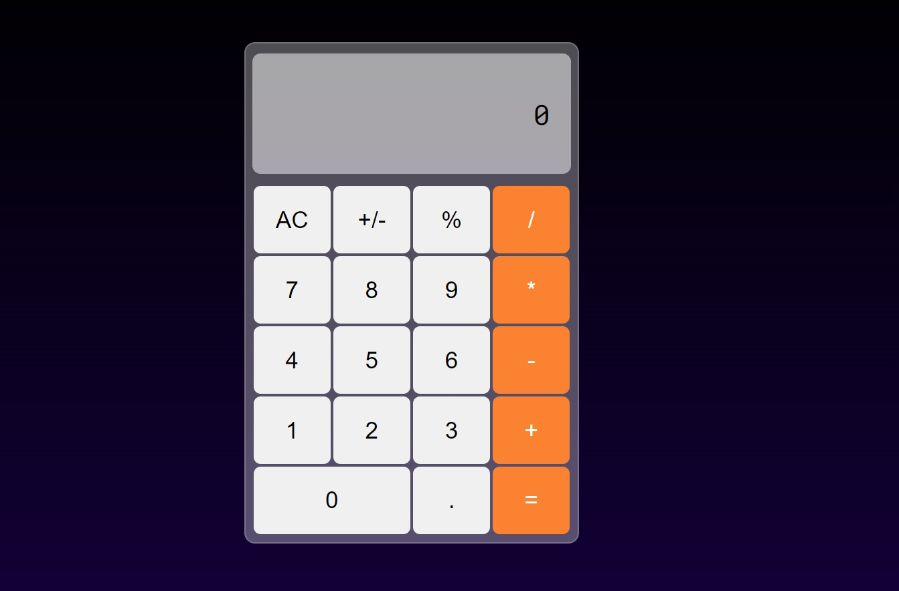

# Calculadora
Projeto de uma calculadora utilizando a biblioteca React.

##  Sobre este projeto
 Este projeto foi importante para o meu aprendizado em React, pois fiz ele do zero e fui aprendendo sobre hooks como useState e useEfect conforme a demanda e necessidade do projeto. Como os componentes se comportam e se comunicam entre si.
 Tambem coloquei um prazo de 7 dias para a finalização, e o memso foi finalizado em 4 dias.

Clique no link abaixo para verificar o projeto finalizado

https://calculator-app-rho-nine.vercel.app/

